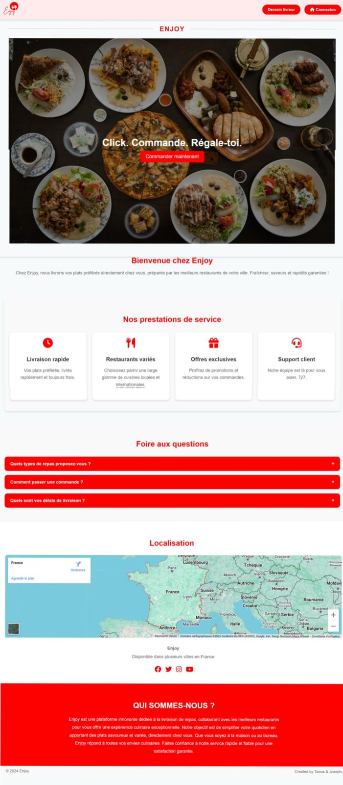
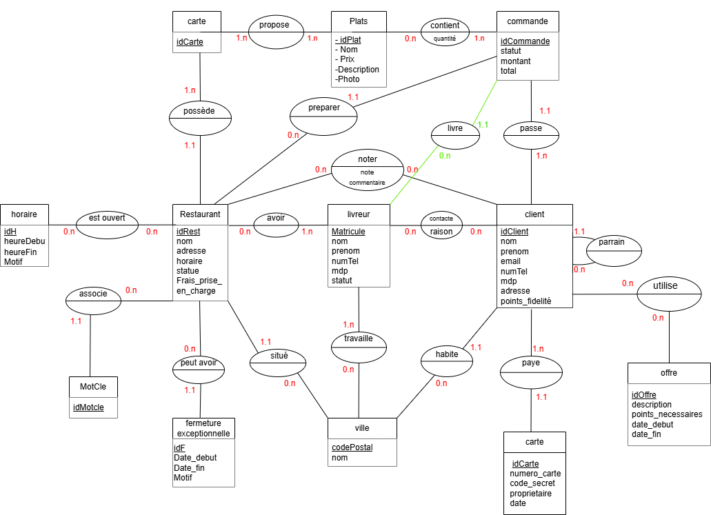

---

# 🍽️ **Enjoy Food - Plateforme de livraison de repas**

## Description  
Enjoy Food est une application web complète de gestion de livraison de repas, développée dans le cadre d'un projet de **Base de Données - L2 Informatique**.  
Le projet est découpé en trois grandes tâches 
1. **Conception du schéma de base de données** (schéma conceptuel + schéma relationnel)  
2. **Mise en place de la base de données** (dump SQL)  
3. **Développement du site web interactif** (backend Flask, frontend HTML/CSS/JS)

---

## Aperçu du projet  
> Voici un aperçu de la page d’accueil de l’application :  


---

## Fonctionnalités principales  

### 👥 Côté client :
- Création de compte avec vérification des champs (email, mot de passe, téléphone, etc.)
- Connexion sécurisée
- Parcourir les restaurants disponibles avec :
  - Barre de recherche multicritère : nom, code postal, mot clé, prix maximum, note maximum
- Visualisation des détails des restaurants (description, plats proposés, prix, notes)
- Passer une commande :
  - Choix du restaurant, plats et quantités
  - Récapitulatif et finalisation de la commande avec calcul automatique du total (commande + livraison)
  - Paiement sécurisé par carte bancaire (validation des informations)
- Historique des commandes : suivi du statut (en attente, prise en charge, livrée), possibilité d’annuler ou de noter une commande si elle n’a pas encore été prise
- Parrainage et points de fidélité
- Possibilité de supprimer son compte

### 🚚 Côté livreur :
- Création de compte livreur (avec attribution automatique d’un matricule)
- Connexion et accès à un profil dédié
- Gestion du statut (disponible / non disponible)
- Gestion des villes couvertes (ajout / suppression)
- Visualisation des commandes disponibles dans ses villes
- Prise en charge d’une commande
- Suppression du compte possible

---

##  Technologies utilisées  

- **Backend** : Python 3 avec Flask  
- **Base de données** : PostgreSQL  
- **Frontend** : HTML / CSS / JavaScript  
- **Bibliothèques Python** :
  - Flask==3.1.0
  - psycopg2==2.9.10
  - py-mon==2.0.5
  - email-validator==2.2.0
  - phonenumbers==8.13.51

---

## Structure du projet  
```
/static                  # Contient les images, logos, fichiers CSS, etc.
/templates               # Pages HTML (accueil, profil, connexion, inscription, etc.)
db.py                    # Fichier contenant les requêtes SQL
main.py                  # Fichier principal pour lancer l’application
dump.sql                 # Dump SQL pour la création de la base de données
requirements.txt         # Liste des dépendances nécessaires
userDB.py                # Fonctions SQL côté utilisateur
utils.py                 # Fonctions de validation (email, mot de passe, matricule, etc.)
```

---

## Installation et lancement  
  
### Cloner le dépôt :  
```bash
git clone https://github.com/taousoumaouche/enjoy_food.git
cd enjoy_food
```
### 🧩 Installation des dépendances :
```bash
pip3 install -r requirements.txt
```
### Restaurer la base de données :  
Assurez-vous que PostgreSQL est bien installé et que vous avez une base de données configurée. Ensuite :  
```bash
psql -U votre_utilisateur -d votre_base -f dump.sql
```

### ⚡ Lancer l’application :  
```bash
pymon main.py
```

*⚠️ Assurez-vous que PostgreSQL est bien installé et que la base de données est restaurée à partir du fichier `dump.sql` avant de lancer le projet.*

---

## Schéma de la base de données  

### Tâche 1 : Schéma conceptuel  


### Tâche 2 : Schéma relationnel  
```bash
Ville(codePostal, nom)
carte(idCarte)
restaurant(idRest, nom, adresse, statut, frais_prise_en_charge, codePostal, idCarte)
livreur(matricule, nom, prenom, numTel, mdp, statut)
client(idClient, nom, prenom, email, numTel, mdp, adresse, points_fidelite, codePostal, idParrain)
offre(idOffre, description, points_necessaires, date_debut, date_fin, statut)
plats(idPlat, nom, prix, description, photo)
horaire(idH, jour, heureDebut, heureFin)
fermetureExceptionnelle(idF, date_debut, date_fin, motif, idRest)
commande(idComm, statut, montant_total, idRest, matricule, idClient)
motCle(idMotcle, libelle, idRest)
carteBancaire(idCarte, numero_carte, code_secret, proprietaire, date_expiration, idClient)
propose(idPlat, idCarte)
contient(idPlat, idComm, quantite)
est_ouvert(idH, idRest)
avoir(idRest, matricule)
contacte(matricule, idClient, raison)
travaille(matricule, codePostal)
utilise(idClient, idOffre)
noter(idRest, idClient, note, commentaire)

Clefs étrangères :
— codePostal dans restaurant fait référence à codePostal dans ville
— idCarte dans restaurant fait référence à idCarte dans carte
— codePostal dans client fait référence à codePostal dans ville
— idParrain dans client fait référence à idClient dans client (parrain)
— idRest dans fermetureExceptionnelle fait référence à idRest dans restaurant
— matricule dans commande fait référence à matricule dans livreur
— idClient dans commande fait référence à idClient dans client
— idRest dans motCle fait référence à idRest dans restaurant
— idClient dans carteBancaire fait référence à idClient dans client
— idPlat dans propose fait référence à idPlat dans plat
— idCarte dans propose fait référence à idCarte dans carte
— idPlat dans contient fait référence à idPlat dans plat
— idComm dans contient fait référence à idComm dans commande
— idH dans est_ouvert fait référence à idH dans horaire
— idRest dans est_ouvert fait référence à idRest dans restaurant
— idRest dans avoir fait référence à idRest dans restaurant
— matricule dans contacte fait référence à matricule dans livreur
— idClient dans contacte fait référence à idClient dans client
— matricule dans travaille fait référence à matricule dans livreur
— codePostal dans travaille fait référence à codePostal dans ville
— idClient dans utilise fait référence à idClient dans client
— idOffre dans utilise fait référence à idOffre dans offre
— idRest dans noter fait référence à idRest dans restaurant
— idClient dans noter fait référence à idClient dans client
```
---

## Auteurs  
Projet réalisé par :  
- **Oumaouche Taous**  
- **El Sabbagh Joseph**

> 💡 Même si la majorité du travail a été réalisée par Oumaouche Taous, le projet a été présenté en binôme.

---

## Licence  
Ce projet est libre d’utilisation et de modification à des fins **pédagogiques** ou **personnelles**.  
N’hésitez pas à contribuer ou à proposer des améliorations !

---
